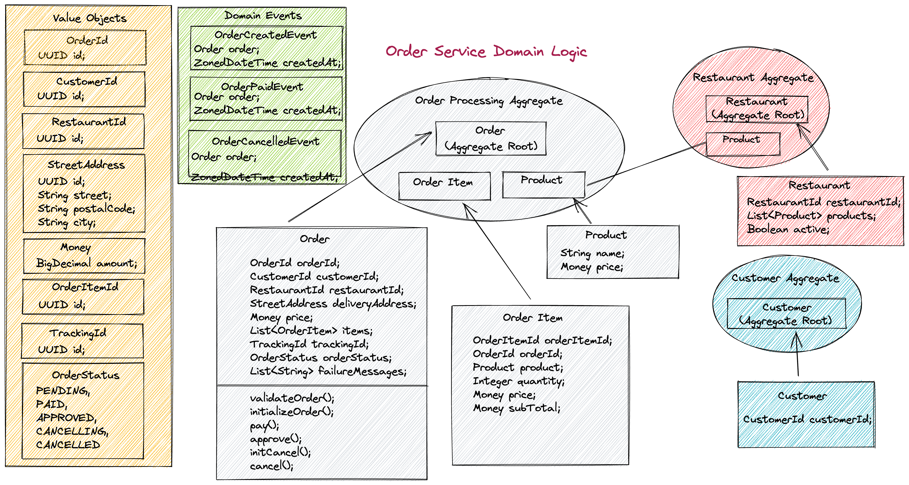

# Food Ordering System

## 시스템 개요

Food Ordering System은 주문, 결제, 음식 준비, 배송 등 전체 주문 흐름을 관리하는 시스템입니다.
아래는 Order Service의 헥사고날 아키텍처 구조를 시각화한 다이어그램입니다.


## 의존성 그래프(Dependency Graph) 생성

Graphviz와 Maven DepGraph 플러그인을 이용해 프로젝트 간 의존성을 시각화할 수 있습니다.

### Graphviz 설치
```bash
sudo apt update
sudo apt install graphviz -y
```
### Maven 명령어 실행
```bash
mvn com.github.ferstl:depgraph-maven-plugin:aggregate \
-DcreateImage=true \
-DreduceEdges=false \
-Dscope=compile \
"-Dincludes=com.food.ordering.system*:*"
)
```


## 도메인 로직 구조
Order Service 내부의 도메인 로직 흐름을 나타낸 다이어그램입니다.
각 계층이 어떻게 상호작용하는지 확인할 수 있습니다.



