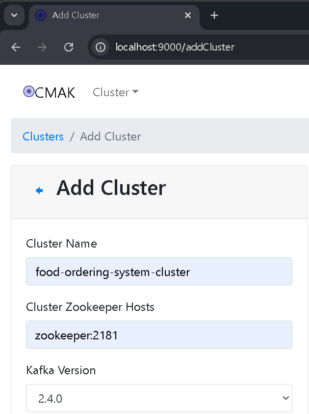

tab1 : docker compose -f common.yml -f zookeeper.yml up
tab2 : echo ruok | nc localhost 2181
tab3 : sudo docker compose -f common.yml -f kafka_cluster.yml up
tab4 : sudo docker compose -f common.yml -f init_kafka.yml up
